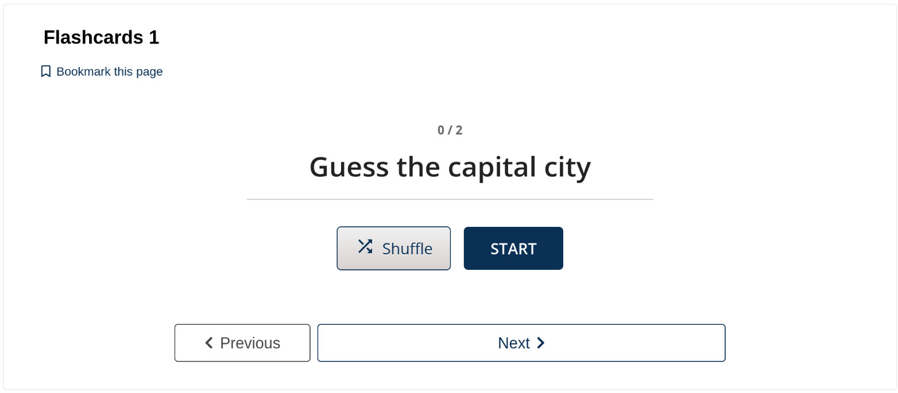
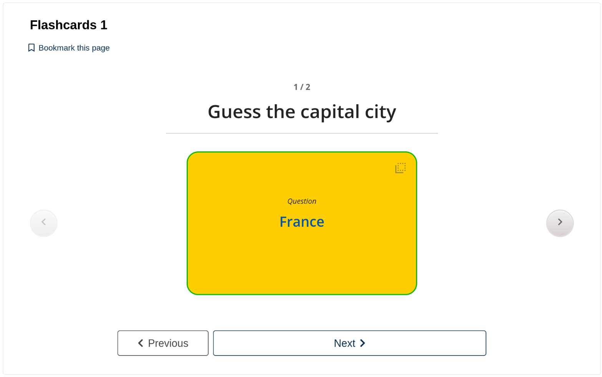
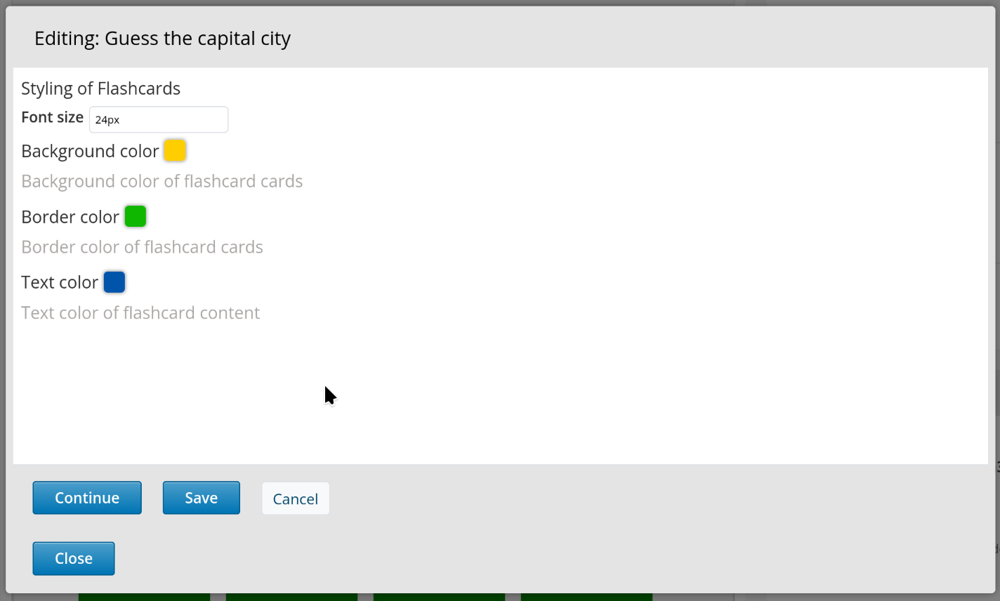
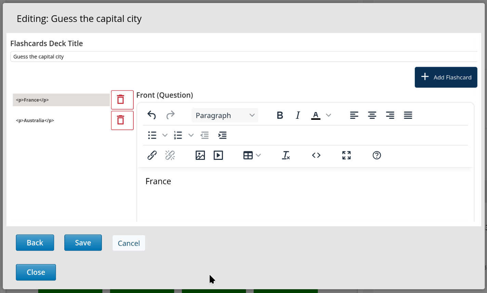

# FlashcardsXBlock

An Open edX platform XBlock to create and display flashcards.

## Installation

In a Tutor deployment, you can add it to `OPENEDX_EXTRA_PIP_REQUIREMENTS`, installing from git:

```yaml
OPENEDX_EXTRA_PIP_REQUIREMENTS:
- git+https://github.com/open-craft/FlashcardsXBlock.git@main
```

Or from a [Pypi release](https://pypi.org/project/FlashcardsXBlock/):

```yaml
OPENEDX_EXTRA_PIP_REQUIREMENTS:
- FlashcardsXBlock==1.0.1
```

## Usage

Once the Flashcards XBlock is installed in the Open edX environment,
you can navigate to the "Advanced settings" of the course in Studio or Authoring,
then add "flashcards" to the "Advanced module list".

Then navigate to the unit in the course where you want to add a Flashcards component,
and select "Flashcards" from the "Advanced" component list.

## Screenshots

Student view:





Editing modal in Authoring:





## Development notes

- There is a Github workflow that automatically creates Pypi releases when you create a release on Github.

## Want to contribute?

If you have a suggestion, question or found a bug, please [open an issue](https://github.com/open-craft/FlashcardsXBlock/issues/new).

If you would like to contribute code, please open a pull request with details about the changes that you propose.
